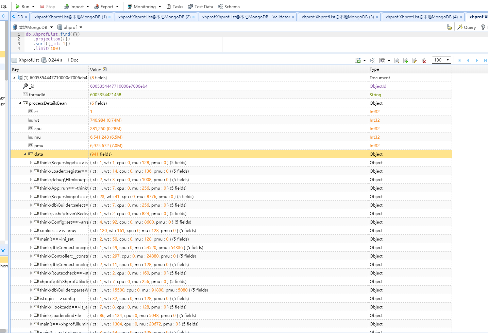

### xhprof_ext

### 环境

- PHP 7.1+.
- xhprof或tideways_xhprof 需要支持7.0以上环境
- redis 3.0+
- mongo 4.2+

### 引入方式
- main.php 为引导入口

 ```shell script
### apache
php_admin_value auto_prepend_file "~/main.php"

### nginx 
fastcgi_param PHP_VALUE "~/main.php"
```

### mongo存储桶
- performanceStatistics:性能分析详情队列KEY
### redis存储桶
- TrafficShaperKey:令牌桶KEY


### 时间损耗
```shell script
real    0m0.096s
user    0m0.000s
sys     0m0.015s
```
### 数据存储呈现效果

